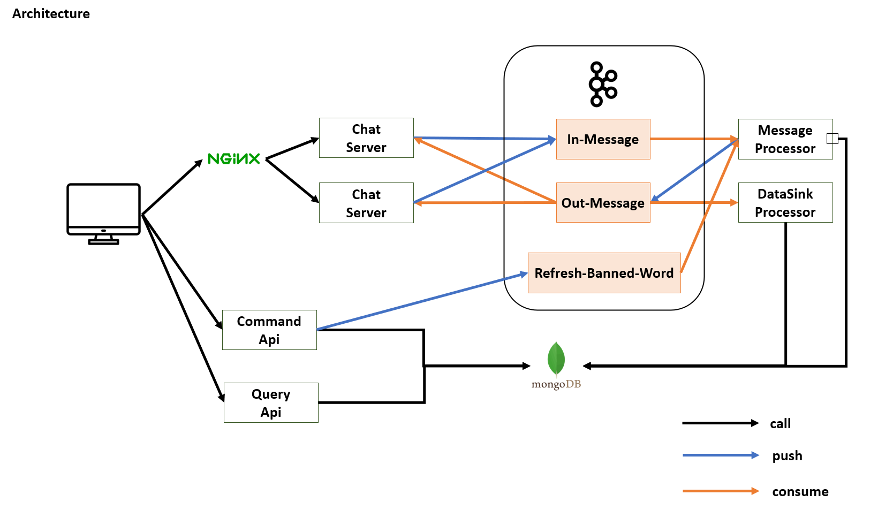

# 고민한 사항
- 채팅방 WebSocket Session을 서버에서 어떻게 관리할까
  - WebSocketSession을 In-Memory에 Map 구조로 관리
  - 같은 채팅방 Session을 같은 Server에 저장
    - 장점
      - 같은 채팅방에 메세지 전송시 별도의 처리 불 필요
    - 단점
      - 서버별 트래픽 편차 발생
  - 같은 채팅방 Session을 서버들에 분산 시켜 저장
    - 장점
      - 서버 자원 고르게 사용
    - 단점
      - 같은 채팅방에 메세지 전송을 위해 서버간 이벤트 전달 필요
  - 채택
    - 같은 채팅방 Session을 서버들에 분산 시켜 저장
  - 이유
    - 메세지 송수신시 CPU를 많이 사용하기에 scale out 필요
    - 다양한 후처리는 처리량을 높이기 위해 비동기로 처리할 예정이기에 이벤트 큐를 사용하는걸 단점으로 생각하지 않음

  

- 카프카 컨슈머 그룹을 이용해 하나의 이벤트를 여러 서버에서 consume 하기

# 아키텍처

# 정리 기술
- WebSocket
- Kafka
